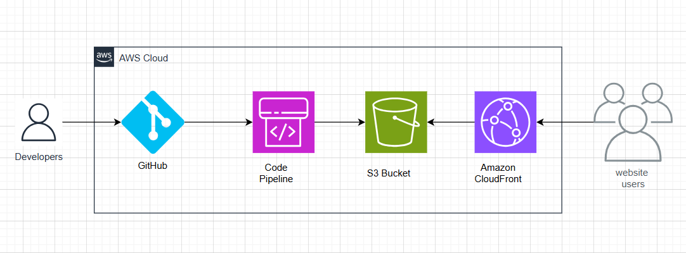

# AWS Static Web Hosting with CI/CD Pipeline



A complete DevOps solution for hosting a static website on AWS with automated deployment pipeline using CloudFormation, S3, CloudFront CDN, and CodePipeline.

## 🏗️ Architecture Overview

This project demonstrates a modern static website hosting solution on AWS with the following components:

- **S3 Bucket**: Hosts the static website files (HTML, CSS, JS)
- **CloudFront CDN**: Global content delivery network for fast loading
- **CodePipeline**: Automated CI/CD pipeline for deployments
- **CodeBuild**: Build service for processing source code
- **GitHub Integration**: Source code repository connection
- **Parameter Store**: Secure configuration management
- **CloudFormation**: Infrastructure as Code (IaC) for reproducible deployments

## 📁 Project Structure

```
aws-static-web-hosting/
├── index.html              # Main HTML file with modern design
├── css/
│   └── styles.css          # Comprehensive CSS styling
├── cloudformation/         # Infrastructure templates
├── scripts/               # Deployment and utility scripts
├── image.png              # Architecture diagram
└── README.md              # This documentation
```

## 🚀 Features

### Website Features
- **Modern Design**: Clean, professional interface with gradient backgrounds
- **Responsive Layout**: Mobile-first design that works on all devices
- **Performance Optimized**: Fast loading with optimized CSS and fonts
- **Semantic HTML**: Accessible and SEO-friendly structure

### Infrastructure Features
- **Automated Deployment**: Push to GitHub triggers automatic deployment
- **Global CDN**: CloudFront distribution for worldwide fast access
- **SSL/HTTPS**: Secure connections with AWS Certificate Manager
- **Cost Optimized**: S3 static hosting is highly cost-effective
- **Scalable**: Handles traffic spikes automatically
- **Version Control**: Complete deployment history and rollback capability

## 🛠️ Deployment Steps

### Prerequisites
- AWS CLI configured with appropriate permissions
- GitHub repository with source code
- Domain name (optional, for custom domain)

### 1. Parameter Configuration
Update AWS Systems Manager Parameter Store with your configuration:


### 2. Deploy Infrastructure
```bash
# Deploy the CloudFormation stack
aws cloudformation deploy \
  --template-file cloudformation/main-template.yaml \
  --stack-name static-web-hosting \
  --parameter-overrides \
    GitHubRepo=your-username/your-repo \
    DomainName=yourdomain.com \
  --capabilities CAPABILITY_IAM
```

### 3. Configure GitHub Connection
- Go to AWS CodePipeline console
- Update the source connection to authorize GitHub access
- Test the connection with a commit

### 4. Verify Deployment
- Check S3 bucket for uploaded files
- Access CloudFront distribution URL
- Verify SSL certificate (if using custom domain)

## 🔧 AWS Services Used

| Service | Purpose | Cost Impact |
|---------|---------|-------------|
| **S3** | Static file hosting | ~$0.01-0.05/month |
| **CloudFront** | Global CDN | ~$0.10-1.00/month |
| **CodePipeline** | CI/CD automation | ~$1/month per pipeline |
| **CodeBuild** | Build processing | Pay per build minute |
| **Parameter Store** | Configuration management | Free tier available |
| **CloudFormation** | Infrastructure management | Free |

## 📊 Performance Benefits

- **Global Reach**: CloudFront edge locations worldwide
- **Fast Loading**: CDN caching reduces load times by 60-80%
- **High Availability**: 99.9% uptime SLA
- **Auto Scaling**: Handles traffic from 1 to millions of users
- **Security**: AWS security best practices built-in

## 🔄 CI/CD Pipeline Flow

1. **Developer** pushes code to GitHub repository
2. **GitHub webhook** triggers CodePipeline
3. **CodePipeline** pulls source code
4. **CodeBuild** processes and builds the application
5. **Deployment stage** uploads files to S3 bucket
6. **CloudFront** invalidation ensures fresh content delivery
7. **Website** is automatically updated with new changes

## 🛡️ Security Features

- **HTTPS Only**: SSL/TLS encryption for all traffic
- **IAM Roles**: Least privilege access for all services
- **Bucket Policies**: Secure S3 access configuration
- **CloudTrail**: Complete audit trail of all activities
- **Parameter Store**: Encrypted storage for sensitive configuration

## 🧹 Cleanup Commands

To avoid ongoing charges, clean up resources:

```bash
# Empty S3 bucket before deletion
aws s3 rm s3://your-bucket-name --recursive

# Delete CloudFormation stack
aws cloudformation delete-stack --stack-name static-web-hosting
```

## 📚 Learning Outcomes

This project demonstrates:
- **Infrastructure as Code** with CloudFormation
- **CI/CD Pipeline** implementation
- **AWS Best Practices** for static hosting
- **Cost Optimization** strategies
- **Security Implementation** in the cloud
- **Modern Web Development** practices

## 🤝 Contributing

1. Fork the repository
2. Create a feature branch
3. Make your changes
4. Test the deployment
5. Submit a pull request

## 📞 Support

For questions or issues:
- Check AWS CloudFormation console for stack events
- Review CodePipeline execution details
- Monitor CloudWatch logs for detailed error information

---

**Level Up In Tech DevOps Practice** - Building practical cloud solutions one deployment at a time! 🚀